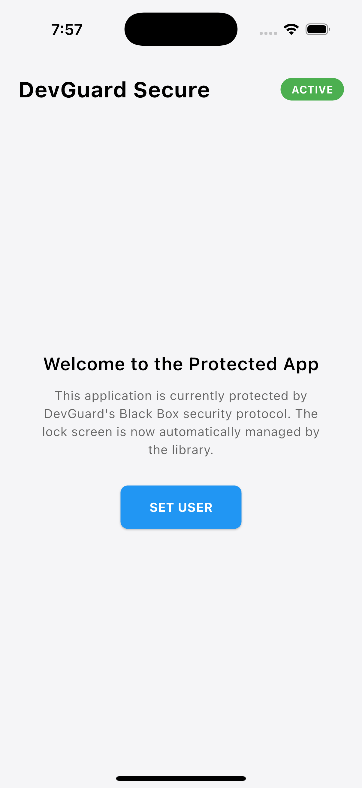
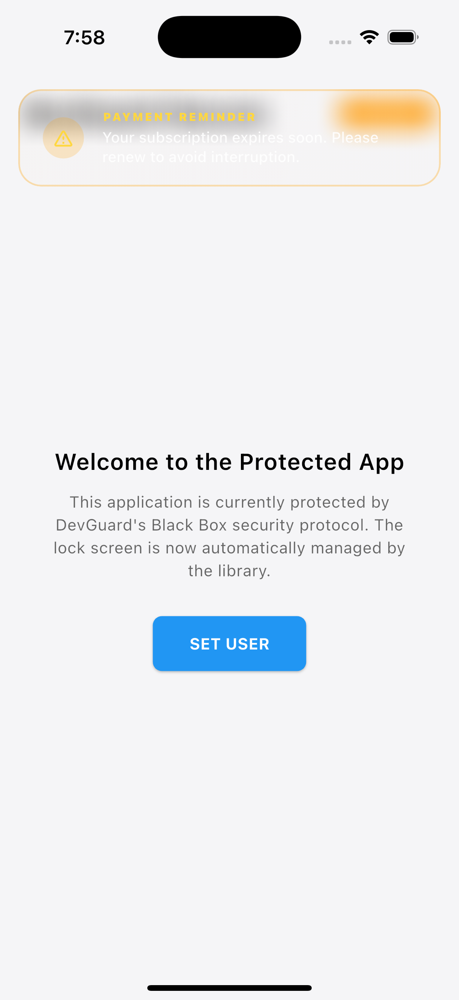
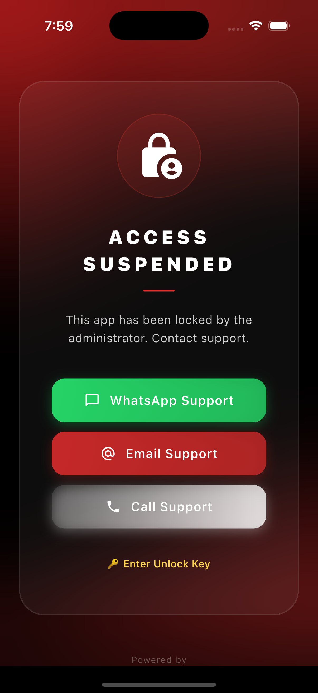

# DevGuard (Flutter)

<p align="center">
  <a href="https://devguard.uk"></a>
  
  
</p>

**Protect your apps. Get paid.** DevGuard is a remote licensing and application-protection layer for Flutter. Remotely **lock, warn, wipe, and monitor** your published apps from the DevGuard dashboard — ideal for agencies and developers who need to enforce payment terms or revoke access to client deliverables. Security-critical operations (HMAC signing, the shared secret, GZip telemetry) run inside the compiled **`devguard_core` FFI library** so your keys never sit in plain Dart.

> 👉 **Create your free account and grab your keys at [devguard.uk](https://devguard.uk).**
> You'll need a **Project ID** and a **Master Secret** to initialize the SDK.

## 📱 How it looks

The Lock Screen, warning banner, and diagnostics overlay are all **built in** — you don't build any UI. DevGuard renders the right screen automatically based on the status returned by your dashboard.

<table>
  <tr>
    <td align="center" width="33%"></td>
    <td align="center" width="33%"></td>
    <td align="center" width="33%"></td>
  </tr>
  <tr>
    <td align="center"><b>Active &amp; Protected</b><br/>Your app runs normally · <code>ACTIVE</code></td>
    <td align="center"><b>In-App Warning</b><br/>Non-blocking banner (e.g. payment reminder) · <code>WARNING</code></td>
    <td align="center"><b>Access Suspended</b><br/>Automatic Lock Screen with your support contacts · <code>LOCKED</code></td>
  </tr>
</table>

## ✨ Features

- **Glassmorphic Lock Screen**: Premium, built-in UI that blocks access instantly — with your WhatsApp / Email / Call support buttons and an optional unlock-key entry.
- **Native Security**: Native signing and the secret are handled in compiled C++ to prevent secret extraction.
- **GZip Tunneling**: Compact telemetry payloads for minimum data usage.
- **Remote Config**: Access server-defined JSON settings via `GuardResponse.extraData` and `betaFeatures`.
- **Heartbeat & Sync**: Automated background pings (with `lifecycleSync` / `syncPolicy` support) to keep license status fresh.
- **Hardware Fingerprinting**: Robust device identity that survives app re-installs.
- **Emulator Blocking**: When the project enables `blockEmulators`, the SDK locks on emulators/simulators automatically.
- **Hardened Remote Wipe**: Nonce-based remote wipe clears the response cache, usage logs, encrypted vault diagnostics, and stored device-user identity.
- **Privacy-Gated Telemetry**: Advanced metrics (RAM, storage, battery, network) are only collected after the server enables `advancedTelemetry`.

## 🚀 Getting Started

### 1. Create your DevGuard account

1. Sign up at **[devguard.uk](https://devguard.uk)**.
2. Create a **Project** in the dashboard.
3. Copy your **Project ID** and **Master Secret** (Settings → Master Secret). You'll pass both to the SDK below.

### 2. Install

```yaml
dependencies:
  dev_guard: ^1.0.1
```

### 3. Platform setup

#### Requirements
- **Flutter** SDK ≥ 3.41 · **Dart** ≥ 3.11
- **iOS** 13+ · **Android** minSdk 21+
- **Android build toolchain** (required by current transitive plugins): Java 17, Kotlin 2.2.0, Android Gradle Plugin ≥ 8.12.1, Gradle wrapper ≥ 8.13

#### Android
Add to `AndroidManifest.xml` (lock-screen contact links):

```xml
<queries>
  <intent>
    <action android:name="android.intent.action.VIEW" />
    <data android:scheme="mailto" />
  </intent>
  <intent>
    <action android:name="android.intent.action.VIEW" />
    <data android:scheme="tel" />
  </intent>
</queries>
```

#### iOS
Add to `Info.plist` (contact links + jailbreak detection via `root_jailbreak_guard`):

```xml
<key>LSApplicationQueriesSchemes</key>
<array>
  <string>cydia</string>
  <string>mailto</string>
  <string>tel</string>
  <string>whatsapp</string>
</array>
```

### 4. Protect your app

Initialize DevGuard before calling `runApp`, then wrap your app with `DevGuard.wrap`. Once the status returned by your dashboard is `LOCKED`, the Lock Screen appears automatically.

```dart
import 'package:flutter/material.dart';
import 'package:dev_guard/dev_guard.dart';

void main() async {
  WidgetsFlutterBinding.ensureInitialized();

  await DevGuard.init(
    projectId: 'your_project_id',   // From the DevGuard dashboard
    secret: 'YOUR_MASTER_SECRET',   // Settings → Master Secret
    failSafe: FailSafe.open,        // FailSafe.closed locks when offline with no cache
  );

  runApp(DevGuard.wrap(child: const MyApp()));
}
```

## 🧭 Status lifecycle

DevGuard syncs on app launch, on foreground/background, and on a server-defined heartbeat. The current `status` drives what the user sees:

| Status | Meaning | What the user sees |
| --- | --- | --- |
| `ACTIVE` | Valid license / access granted. | Your app, running normally. |
| `WARNING` | App still works, but a notice is shown. | A non-blocking banner at the top (e.g. *"Payment reminder"*). |
| `LOCKED` | Access revoked by you. | The built-in **Lock Screen**. |
| `EXPIRED` | License expired. | Treated as locked. |
| `PENDING` | Initial state before the first successful sync (`failSafe: open`). | Your app (optimistic). |
| `ERROR` | Sync failed. | Depends on `failSafe` (see below). |

## 🪝 API

### `DevGuard.init` parameters

| Parameter | Type | Default | Description |
| --- | --- | --- | --- |
| `projectId` | `String` | **required** | Your DevGuard project ID. |
| `secret` | `String` | — | Your account **Master Secret** (Settings → Master Secret). |
| `failSafe` | `FailSafe` | `FailSafe.open` | Offline-with-no-cache behavior. `open` keeps the app usable; `closed` locks it. |
| `statusUrl` | `String?` | production API | Optional custom API endpoint. |

### Reactive status

```dart
StreamBuilder<GuardResponse?>(
  stream: DevGuard.onStatusChanged,
  initialData: DevGuard.currentResponse,
  builder: (context, snapshot) {
    final status = snapshot.data?.status;
    // React to ACTIVE / WARNING / LOCKED
    return MyWidget();
  },
);
```

| API | Description |
| --- | --- |
| `DevGuard.currentResponse` | Latest `GuardResponse` (or `null` before first sync). |
| `DevGuard.onStatusChanged` | Stream of status updates from the server. |
| `DevGuard.syncStatus()` | Manually trigger a license sync. |
| `DevGuard.setDeviceUser(...)` | Register the signed-in app user so they appear in the Developer Portal. |

### Track app users in the Developer Portal

When someone signs in or registers in your app, pass their profile to DevGuard. You'll then be able to see **how many users are using your application** in the **Developer Portal** — total user count, recent activity, and basic profile fields (username, email, phone, and any custom metadata you attach).

Call this after login or registration (all parameters are optional):

```dart
await DevGuard.setDeviceUser(
  username: 'jane_doe',
  email: 'jane@example.com',
  phone: '+15551234567',
  customData: {'plan': 'pro'},
);
```

Open **Developer Portal → Users** to view your app's user base and engagement.

### Custom events

```dart
UsageLogger.logEvent('purchase_clicked', data: {'plan': 'pro'});
```

## 🐞 Diagnostic Overlay

To view telemetry and logs directly inside the running app:

1. Go to your DevGuard Admin Control Center.
2. Configure a **6-digit Diagnostic Passcode**.
3. Toggle on **Enable Diagnostic Logs** (beta feature) for the desired devices.
4. A floating **bug icon** appears in your app.
5. Tap it and enter your passcode to view device telemetry and encrypted error vaults.

## ⚙️ Configuration

### Fail-Safe Modes
- **`FailSafe.open` (Default)**: If the server is unreachable and no cache exists, the app remains accessible.
- **`FailSafe.closed`**: The app locks until a successful status is fetched.

### Optional: Passive GPS (Advanced Telemetry)

When **Advanced Telemetry** is enabled in the Admin Panel, the plugin may attach a cached GPS coordinate during sync. DevGuard **never prompts** for location during sync — your host app must request permission separately.

**Android (`AndroidManifest.xml`):**
```xml
<uses-permission android:name="android.permission.ACCESS_FINE_LOCATION" />
```

**iOS (`Info.plist`):**
```xml
<key>NSLocationWhenInUseUsageDescription</key>
<string>Used for device telemetry when advanced telemetry is enabled.</string>
```

## 🔐 Security Best Practices

1. **Obfuscation (two layers)**:
   - **SDK**: Wire protocol and native symbols are hardened inside the plugin (runtime XOR decode + opaque FFI exports).
   - **Your app**: Always build release with `--obfuscate --split-debug-info=./debug_info`:
     ```bash
     flutter build apk --obfuscate --split-debug-info=./debug_info
     flutter build ios --obfuscate --split-debug-info=./debug_info
     ```
2. **Master Secret**: Never commit your Master Secret to source control.
3. **Response signing**: Invalid server response signatures lock the app immediately.
4. **Jailbreak / root**: Compromised devices are locked via `root_jailbreak_guard`.

## 💬 Support & Contact

- 🌐 **Website / register:** [devguard.uk](https://devguard.uk)
- 📧 **Email:** [contact@devguard.uk](mailto:contact@devguard.uk)
- 🐛 **Issues:** [GitHub Issues](https://github.com/DevGuard-uk/dev_guard/issues)

## 📄 License

MIT © [DevGuard](https://devguard.uk)

---
*Secure by Design. Managed by Ants Solution.*
